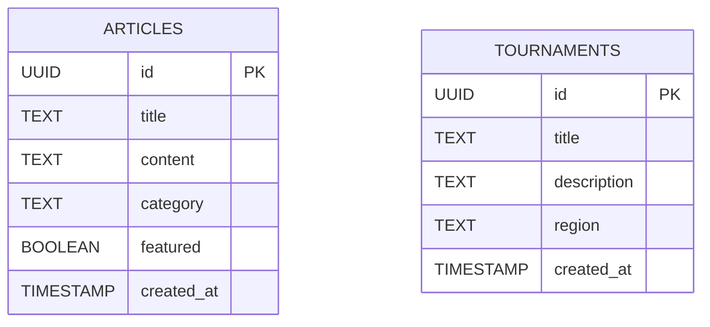
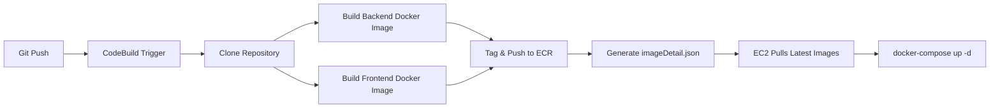

# Architecture Documentation

Auto-Generated Blog Platform  
React • Node.js • PostgreSQL • Docker • AWS EC2 • ECR • CodeBuild

## 1. Introduction

This document provides a comprehensive overview of the architecture supporting the Auto-Generated Blog Platform.  
The system blends full-stack development, containerization, scheduling, and cloud deployment into a single, coherent, production-aligned solution.

Although intentionally simple and cost-efficient, the architecture follows modern engineering practices including:

- Service isolation with Docker
- Automated container builds (CI)
- Immutable deployments via ECR tags
- AI-generated content using HuggingFace
- Minimal but reliable persistence via PostgreSQL

The result is a maintainable, auditable, and extensible platform.

## 2. High-Level Architecture Overview

The system is composed of three main services:

1. **Frontend (React + Nginx)** – Renders UI and interacts with backend
2. **Backend (Node.js + Express)** – REST API, AI integration, cron scheduler
3. **Database (PostgreSQL)** – Persistent structured storage

These services run as Docker containers inside a single AWS EC2 instance.

### High-Level System Diagram

```
┌──────────────────────────────────────────────────────────────┐
│                           AWS EC2                             │
│                                                              │
│  ┌──────────────────┐   REST API    ┌──────────────────────┐ │
│  │    Frontend      │ ─────────────▶│       Backend        │ │
│  │  React + Nginx   │◀──────────────│ Node.js + Cron Jobs  │ │
│  └──────────────────┘               └─────────┬────────────┘ │
│                                               │              │
│                                           SQL Queries        │
│                                               │              │
│                               ┌───────────────▼────────────┐ │
│                               │        PostgreSQL           │ │
│                               └────────────────────────────┘ │
└──────────────────────────────────────────────────────────────┘
```

The platform focuses on robustness through simplicity—avoiding unnecessary complexity such as ECS, Kubernetes, or load balancers.

## 3. Components and Their Responsibilities

### 3.1 Frontend (React + Nginx)

- Built using Vite for fast compilation
- Served via Nginx using a minimal configuration
- Stateless: all dynamic data is fetched from the backend
- Communicates with backend through `/articles`, `/articles/:id`, `/health`

### 3.2 Backend (Node.js + Express)

The backend handles:

- REST API for articles and tournaments
- AI-driven content generation
- Scheduled article creation every 8 hours
- DB initialization on startup
- Logging and exception propagation

Running cron jobs _inside the container_ ensures:

- Versioned behavior (cron logic changes with deployments)
- Easy debugging locally or inside EC2
- Better reproducibility across environments
- No dependency on host-level cron

### 3.3 PostgreSQL (Persistent Storage)

Chosen for:

- Reliability and ACID guarantees
- Low operational overhead
- Compatibility with Docker and local development
- Easy vertical scalability

Minimal schema:

```
articles (
  id UUID PRIMARY KEY,
  title TEXT,
  content TEXT,
  category TEXT,
  featured BOOLEAN DEFAULT false,
  created_at TIMESTAMP DEFAULT now()
)
```

## 4. Database Design (Mermaid Diagram)



The schema is intentionally lightweight to satisfy the challenge requirements while allowing future expansion.

## 5. AI Integration

The backend uses the HuggingFace Inference API with the model:

```
deepseek-ai/DeepSeek-R1-Distill-Qwen-32B
```

### Why This Model?

- Free-tier availability
- Consistent long-form output generation
- No GPU dependency
- Lower operational cost compared to self-hosting
- Satisfies challenge constraints (≤ $5)

### Failure Handling

If the AI API fails:

1. A fallback deterministic article is generated
2. The cron job logs the event
3. The DB still receives a new article

This design guarantees that **an article is always created every 8 hours**.

## 6. CI/CD Pipeline Architecture

### Pipeline Summary

The CI process is managed entirely through AWS CodeBuild:

- Pull repository from GitHub
- Authenticate with ECR
- Build backend & frontend images
- Tag images with timestamp (`YYYYMMDDHHMMSS`)
- Push images to ECR
- Export metadata via `imageDetail.json`

Deployment on EC2 is performed by pulling updated images and re-running `docker-compose`.

## 7. CI/CD Pipeline Diagram (Mermaid)



This pipeline is intentionally simple but fully aligned with modern container deployment practices.

## 8. Docker & Containerization Strategy

### Key principles:

- **Separation of concerns**: each service has its own Dockerfile
- **Multi-stage builds** minimize image size
- **Immutable images** ensure repeatable deployments
- **Environment variables** injected via `.env` on EC2
- **Volume persistence** only required for PostgreSQL

### Why not orchestrate these services?

- The challenge prohibits ECS
- Kubernetes is unnecessary for this scale
- One EC2 machine is sufficient and cost-effective

## 9. Scheduling Architecture (Cron Jobs)

Primary job:

```
0 */8 * * *
```

Reasoning for container-scoped cron:

- Container restarts = cron restarts
- Behavior is versioned with the application
- No configuration drift
- No reliance on host OS

The job:

1. Calls the AI model
2. Formats content
3. Stores the result in PostgreSQL
4. Logs execution details

## 10. Risk Assessment & Mitigation

| Risk                        | Impact                 | Mitigation                                                 |
| --------------------------- | ---------------------- | ---------------------------------------------------------- |
| AI API outage               | Articles not generated | Fallback article generator ensures schedule continuity     |
| EC2 instance crash          | Application downtime   | Docker restart policy + easy redeploy via `docker-compose` |
| DB corruption               | Data loss              | Persistent Docker volume + easy manual backup              |
| High latency to HuggingFace | Slow cron execution    | Timeout handling + retries                                 |
| Disk usage growth (logs)    | EC2 storage pressure   | Use `docker logs --since`, option to rotate logs           |
| Future scaling limits       | Performance issues     | Clear path to migrate to ECS, Fargate, or RDS              |

## 11. Why This Architecture Was Chosen

This architecture balances **real-world engineering practices** with the **simplicity required by the challenge**.

### Key reasons:

1. **Cost Efficiency** – A single EC2 instance keeps the entire system inside free tier limits.
2. **Clarity** – Explicit, transparent control over containers, networking, environment variables, and build pipeline.
3. **Maintainability** – Easy to reason about, debug, or extend.
4. **Simplicity with Realistic Structure** – Mirrors how real production systems behave without unnecessary abstraction layers.
5. **Deterministic Deployments** – ECR-timestamped images ensure reproducibility.
6. **Local Development Parity** – Docker-compose matches EC2 environment closely.
7. **Challenge Compliance** – Requirements prohibit ECS and recommend cost optimization.

This design shows strong engineering judgment: choose complexity only when needed.

## 12. Future Enhancements

If timeline allowed, the architecture could evolve with:

- HTTPS with Nginx + Certbot or ALB
- Fully automated deployments via CodePipeline
- Observability (CloudWatch Logs, Metrics, Alerts)
- RDS migration for managed PostgreSQL
- Redis caching for heavy traffic
- Automatic rollbacks for failed builds
- Admin authentication portal
- Test suite (unit & integration tests)

## 13. Conclusion

This architecture intentionally favors simplicity while adhering to best practices in:

- Containers and isolation
- Infrastructure as immutable artifacts
- Controlled CI/CD
- AI-assisted backend functionality
- Persistent relational storage
- Operational reliability

It fulfills all challenge requirements and provides a clean foundation for future scaling and enhancements.
